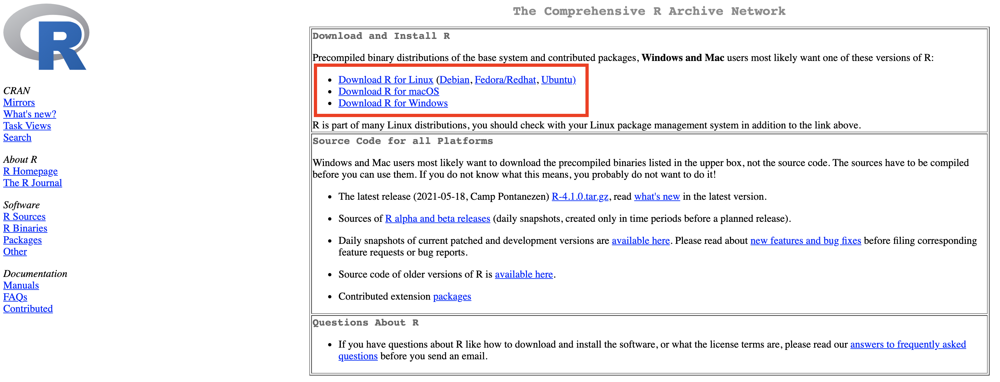
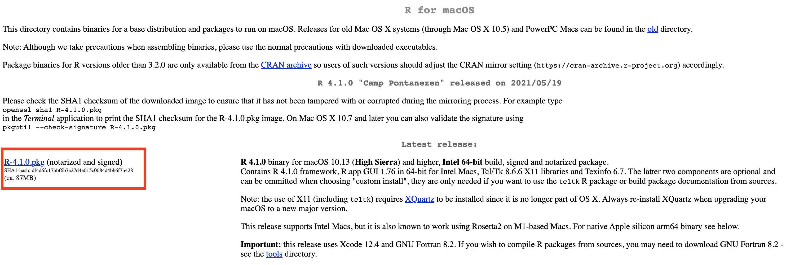
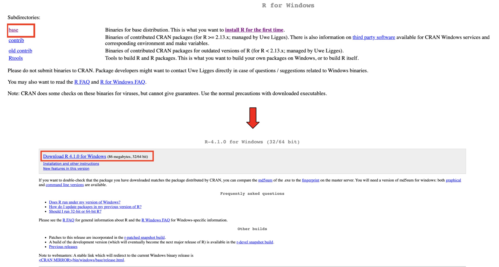
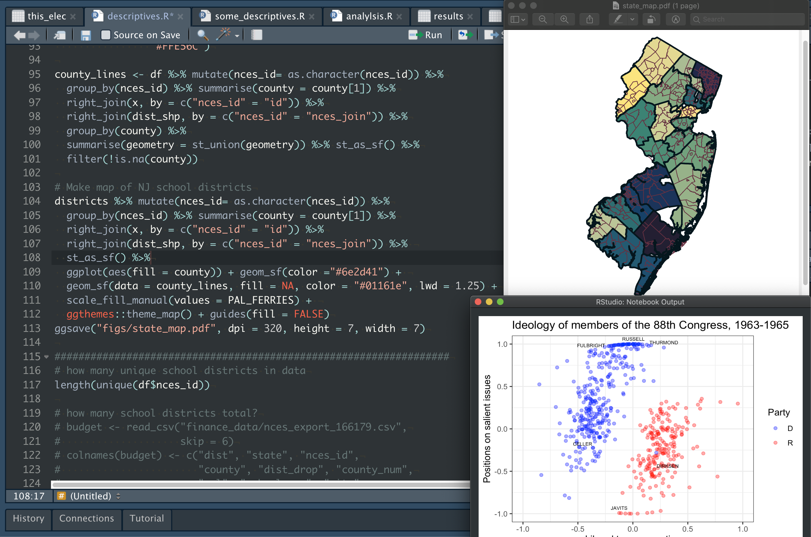
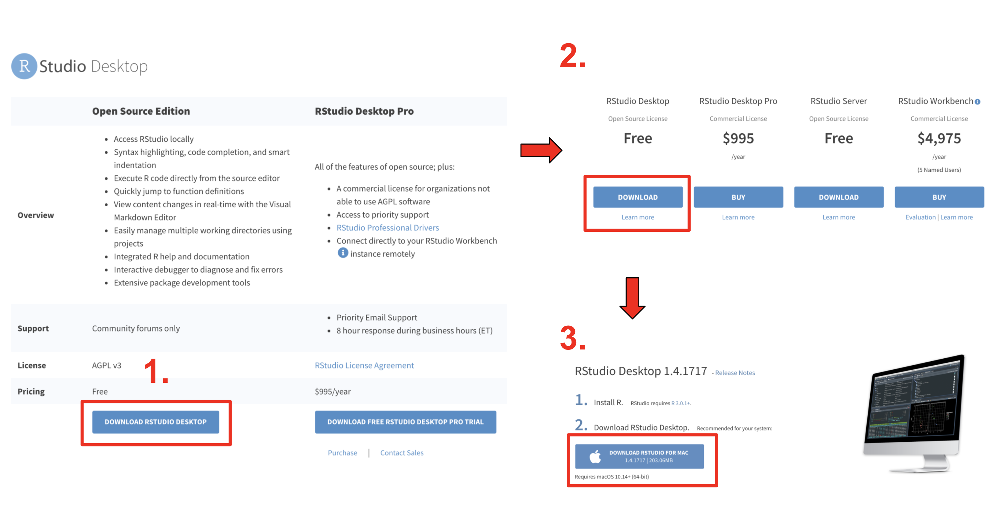
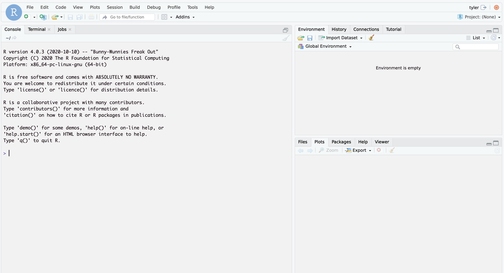
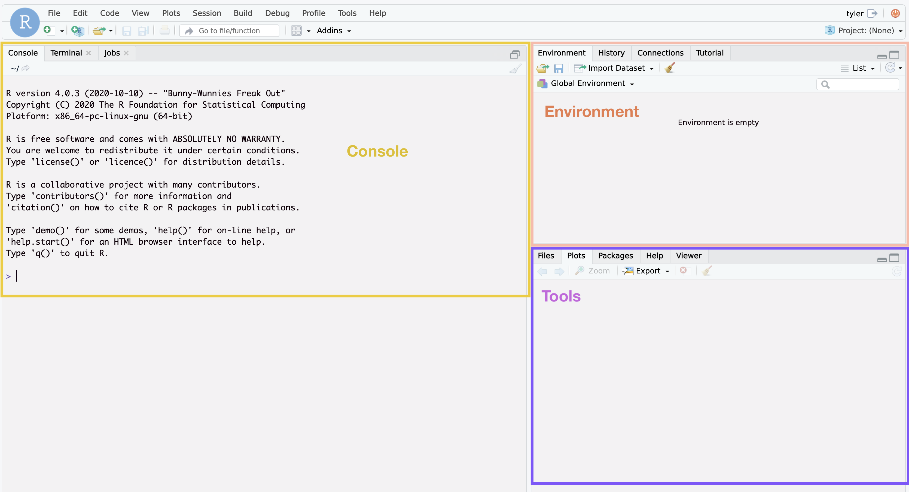
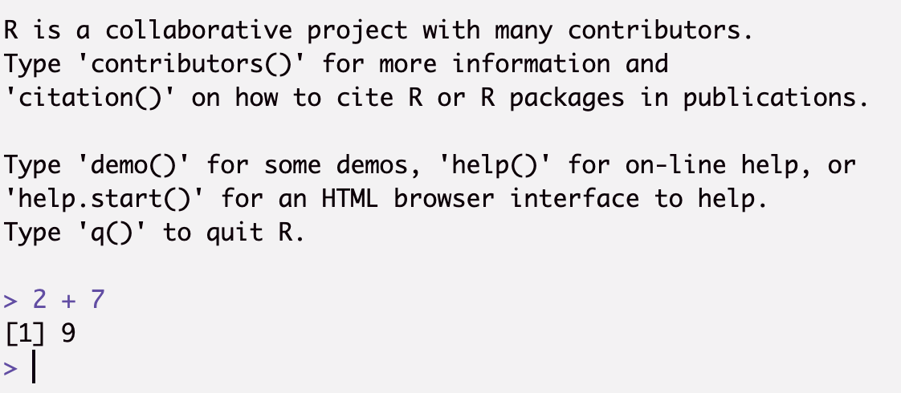
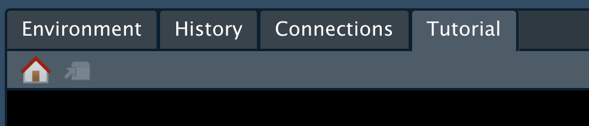
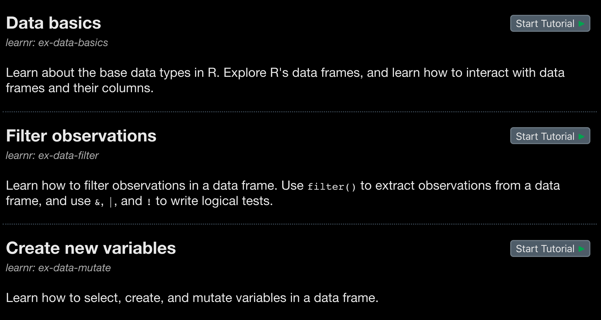

```{r start, include=FALSE, message=FALSE}
knitr::opts_chunk$set(echo = TRUE)
library(tidyverse)
```

For Gov 50, you will need to install some free and safe software. This document will walk you through installing the tools we will be using in this course.

------------------------------------------------------------------------

# Installing R

First, we will install a programming language called `R`. This is the tool we will be using throughout the course to analyze data and make plots.

R is a **programming** language that will help you do useful things with data. R looks like this - although it looks like nonsense to you right now, this will make sense very soon! You can try to read through this code below to get a sense of what it might be doing (I'll put the answer at the very end of this document).

```{r c1, eval=FALSE}
nz <- subset(pop_by_year, country == "New Zealand")
mean(nz$population)
```

To install R, go to [this link](https://cran.r-project.org/): <https://cran.r-project.org/>

On this website, go to the section in the red box below and click on the type of your computer (probably either Windows or Mac).

```{r c2, echo=FALSE, fig.align="center", fig.cap="***Choose Mac or PC depending on what kind of computer you have.***"}

```

If you have a Mac, click on the first `.pkg` link (in the red box below). This will download a file. Open it and follow the instructions to install it like you would any other program.

```{r c3, echo=FALSE, fig.align="center", fig.cap="***If you have a Mac, this screen will look like this.***"}

```

If you have a Windows computer, first click on **base** and then *Download R 4.1.0 for Windows* (in the red boxes below).

```{r c4, echo=FALSE, fig.align="center", fig.cap="***If you have a Windows PC, this screen will look like this.***"}

```

Then, click on the files you downloaded and follow the instructional prompts.

------------------------------------------------------------------------

# Installing RStudio

Once that is done, now we need to install a program called **RStudio**. This is an application that will allow you to interact with the programming language R. Although you can use R without it, RStudio is useful because it will let you see your code, data, plots, and everything else all in one place (and many other reasons that will become clear over the course of the semester!).

```{r c5, echo=FALSE, fig.align="center", fig.cap="***RStudio will help put your data, code, and plots all in one place.***"}

```

To install RStudio, go to [this link](https://www.rstudio.com/products/rstudio/): <https://www.rstudio.com/products/rstudio/>

Once there, follow the picture below to:

1.  Click on **Download Rstudio Desktop**
2.  Select the **Free** version.
3.  Download RStudio for your computer.

Click on the downloaded file and follow the instructions to install RStudio.

```{r c6, echo=FALSE, fig.align="center", fig.cap="***Follow this process to download RStudio.***"}

```

# Using RStudio

When you open the RStudio program for the first time, it will look something like this:

```{r c7, echo=FALSE, fig.align="center", fig.cap="***RStudio: Your new best friend for the semester!***"}

```

There are different sections of RStudio, as described below and shown in the picture:

-   **Console**: this is where your code will be evaluated.
-   **Environment**: this tells you useful things about your code, like which datasets you are using.
-   **Tools**: this section will change depending on what you ask RStudio to show you. For example, plots will show up here.

```{r c8, echo=FALSE, fig.align="center"}

```

Let's try to evaluate some code. In the `>` part of the console, try typing in `2 + 7` like this and press **Enter** (or return depending on your computer):

```{r c9, echo=FALSE, fig.align="center"}

```

Awesome! If that code evaluated to `9`, your installation is working.

Congratulations! You've installed all of the necessary materials for this course.

# Packages

R has many free add-ons that you can use to access new tools. These are called `packages`, and they give you access to code that other people have written to make your life easier.

We'll install some packages that you are going to use for this course to turn in assignments. Paste each line of the code below individually into the console and press Enter. This might take a minute to run, but you will only need to do it once. If you see any errors or bugs, please let someone know and we will help:

```{r c10, eval=FALSE}
install.packages("devtools")
remotes::install_github("kosukeimai/qss-package", build_vignettes = TRUE)
remotes::install_github("rstudio/learnr")
remotes::install_github("rstudio-education/gradethis")
remotes::install_github("mattblackwell/qsslearnr")
```

This should create a new tab called "Tutorial" in the pane with Environment, History, and Connections. 

```{r c11, echo=FALSE, fig.align="center"}

```

Choose one of the tutorials on the list and click "Start Tutorial" to open a new window: 

```{r c12, echo=FALSE, fig.align="center"}

```

If you don't see a Tutorial Tab, you can also open tutorial with code, like this:

```{r learnr, eval = FALSE}
learnr::run_tutorial("00-intro", package = "qsslearnr")
```

If you either see the Tutorial tab or the code above opens a window with a tutorial, then you are all set and ready to go.

# Slack

Gov 50 will also use Slack for course communications. I will share a link with you to sign-up for the course Slack. If you've never used Slack before, the link will ask you to download the program.

**Congratulations**!! If you've gotten to this point, you are all set with the materials for this course. You are going to learn a lot!

::: {.tocify-extend-page data-unique="tocify-extend-page" style="height: 0;"}
:::
